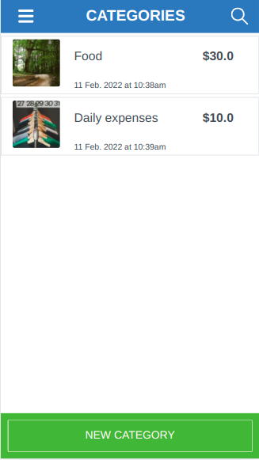

# TrackMyCa$h App

> This project consists of an web app to track your budget. It was proposed as Capstone Project for the Microverse Ruby on Rails module.



# ERD


# Video

You can see this app working [here](https://www.loom.com/share/583fcb82907c466ca246ddaf713e5e9b).

## Built With

- Ruby
- Ruby on Rails
- Devise
- Capybara
- CSS

### Prerequisites

- Ruby >= 3.0.0

### Setup

- Run git clone on this project at the desired directory:
   ```
   git clone https://github.com/nachosala89/budget-app-rails.git
   ```
- Go to the cloned directory with `cd budget-app-rails`.
- Install dependencies with bundle install.
- install RSpec on your system with `gem install rspec`.

### Run the program
- Follow the setup instructions.
- Make sure you're inside the correct directory `budget-app-rails`.
- Run `bin/rails server` on the terminal to start Puma server.
- In your browser, go to `http://127.0.0.1:3000` to interact with the site.

### Test

- Rspec Test Tool
``` 
rspec spec/
```

## Authors

👤 **Nacho Sala**

- GitHub: [@nachosala89](https://github.com/nachosala89)
- Twitter: [@nachosala89](https://twitter.com/nachosala89)
- LinkedIn: [Juan Ignacio Sala](https://www.linkedin.com/in/nacho-sala)

## 🤝 Contributing

Contributions, issues, and feature requests are welcome!

## Show your support

Give a ⭐️ if you like this project! 😄
